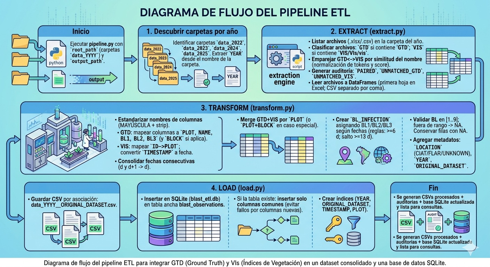

# ETL Pipeline – Rice BLAST (CIAT) | GTD -  VIs (Pheno-i)



## 1) Propósito del repositorio
Este repositorio contiene un **pipeline ETL en Python** diseñado para integrar datos experimentales del estudio de la enfermedad **Rice Blast** en arroz, combinando:

- **Ground Truth (GTD):** evaluaciones visuales de severidad registradas por operarios en campo (BL1, BL2, BL3) en archivos Excel.
- **Vegetation Indices (VIs):** métricas cuantitativas derivadas de ortomosaicos de dron (RGB + multiespectral) procesados con **Pheno-i**, disponibles en CSV o Excel e incluyendo la variable **TIMESTAMP**.

En el contexto del **CIAT (Palmira, Colombia)** y ensayos asociados (p. ej., CIAT/FLAR), estas fuentes suelen permanecer separadas y con convenciones variables (nombres de columnas, llaves, fechas). Esto incrementa el tiempo de preparación de datos y eleva el riesgo de inconsistencias antes del análisis/modelamiento.

El objetivo principal del proyecto es implementar un pipeline **reproducible** que:
1) descubra y lea datos por año,  
2) empareje automáticamente GTD↔VIs,  
3) estandarice columnas y fechas,  
4) construya una variable final de severidad alineada con VIs (**BL_INFECTION**),  
5) exporte resultados y cargue en una base de datos (SQLite),  
6) instrumente **OKR/KPI** para evaluar cobertura, calidad y desempeño operacional.

---

## 2) Estructura del repositorio

```
├── data/
│   ├── raw/
│   │   ├── data_2022/
│   │   ├── data_2023/
│   │   ├── data_2024/
│   │   └── data_2025/
│   ├── processed/
│   │   └── processed/                # CSVs por asociación (salida)
│   ├── db/
│   │   └── blast_etl.db              # SQLite (salida)
│   └── reports/
│       ├── pairing_audit.csv         # Auditoría de emparejamiento
│       ├── schema_report.csv         # Chequeo esquema (KR2)
│       ├── pipeline_kpis.csv         # KPIs por par y por ejecución
│       └── kr1_report.csv            # Cobertura KR1 por asociación
├── src/
│   ├── extract.py
│   ├── transform.py
│   ├── load.py
│   └── pipeline.py
├── environment.yml
├── requirements.txt
└── README.md
```
---

## 3) Datos de entrada: cómo están organizados
Los datos se almacenan en carpetas por año con el patrón:

- `data_YYYY/` (ej.: `data_2022`, `data_2023`, ...)

Dentro de cada carpeta se encuentran archivos `.xlsx` y `.csv` asociados a ensayos (Field/Block/Location).

### Clasificación por tipo (regla basada en nombre)
- **VIS:** si el nombre contiene `VIS`, `VIs` o `vis`
- **GTD:** si el nombre contiene `GTD` o `gtd`
- Si no contiene ninguno, se considera GTD (regla conservadora).

---

## 4) Arquitectura del pipeline (diseño modular)
El pipeline se implementó en **4 módulos**:

- **`extract.py`**
  - Lista archivos por año
  - Clasifica GTD/VIS
  - Empareja GTD↔VIS por similitud de nombre
  - Lee archivos a DataFrames (Excel/CSV)

- **`transform.py`**
  - Estandariza nombres de columnas (mayúscula + strip)
  - Mapea alias (PLOT/NAME/BL1..BL3)
  - Ajusta fechas y consolida mediciones consecutivas
  - Construye `BL_INFECTION` y valida rango [1..9]
  - Ensambla salida final por asociación (dataset integrado)

- **`load.py`**
  - Exporta CSV por asociación
  - Carga en SQLite (tabla ancha `blast_observations`)
  - Controla esquema en inserciones (columnas comunes)
  - Crea índices para acelerar consultas
  - Incluye utilidades de lectura y reporte de sanidad (data quality)

- **`pipeline.py`**
  - Orquesta todo el flujo (por año y por asociación)
  - Manejo robusto: si un par falla, continúa con los siguientes
  - Registra auditorías, OKR y KPI

---

## 5) Descripción del flujo ETL

### 5.1 EXTRACT (extract.py)
1. Descubre carpetas `data_YYYY`.
2. Lista archivos `.xlsx/.csv`.
3. Clasifica por tipo: GTD o VIS.
4. Empareja GTD↔VIS por similitud de nombre:
   - normalización (minúsculas, limpieza de tokens como GTD/VIS/BLAST, separadores)
   - similitud tipo *token matching / Jaccard*
   - asignación “greedy” del mejor VIS para cada GTD (con `min_score`)
5. Produce:
   - lista `PAIRED`
   - auditorías `UNMATCHED_GTD` y `UNMATCHED_VIS`
6. Lee archivos:
   - VIS CSV: `pd.read_csv(sep=",")`
   - Excel: primera hoja

**Salida:** `df_gtd_raw`, `df_vis_raw` por cada asociación.

---

### 5.2 TRANSFORM (transform.py)
**Objetivo:** estandarizar y alinear GTD (BL1/BL2/BL3) con fechas VIs, construyendo `BL_INFECTION`.

- **Estandarización columnas:**
  - mayúsculas
  - eliminación de espacios laterales

- **Preparación GTD:**
  - asegurar: `PLOT`, `NAME`, `BL1`, `BL2`, `BL3`
  - alias típicos:
    - `CONSECUTIVO`, `OBS`, `EXP PLOT ORDER` → `PLOT`
    - `MATERIAL`, `DESIGNACION`, `NOMBRE` → `NAME`
  - si `PLOT` no existe: genera `1..n` para continuidad
  - caso especial **FLAR 2023**: merge por `PLOT + BLOCK`

- **Preparación VIS:**
  - `ID` → `PLOT` cuando aplica
  - `TIMESTAMP` → fecha `YYYY-MM-DD`
  - preserva todas las métricas (tabla ancha)

- **Consolidación de fechas consecutivas:**
  - si hay mediciones en `d` y `d+1`, ambas se consolidan a `d`
  - solo se admite diferencia de **1 día**

- **Mapeo BL ↔ fecha (reglas):**
  - `BL1`: fecha más temprana
  - `BL2`: primera fecha con diferencia ≥ **6 días** desde BL1
  - `BL3`: primera fecha con diferencia ≥ **6 días** desde BL2
  - caso especial: si hay solo 2 fechas y la diferencia ≥ **13 días**, la segunda se asocia a **BL3**

- **Validación severidad:**
  - valores válidos: **[1..9]**
  - fuera de rango (0, 65, "-", etc.) → `NA/NaN`
  - **no se eliminan filas** aunque `BL_INFECTION` quede `NA`

- **Metadatos:**
  - `YEAR`: desde la carpeta `data_YYYY`
  - `LOCATION`: inferido del nombre (CIAT/FLAR/UNKNOWN)
  - `ORIGINAL_DATASET`: nombre GTD sin la cadena “GTD” (incluso si aparece en medio)

**Salida final por asociación:**
`PLOT | BL_INFECTION | LOCATION | YEAR | ORIGINAL_DATASET | NAME | TIMESTAMP | [Índices VIS...]`

---

### 5.3 LOAD (load.py)
- Exporta CSV por asociación:
  - `data_YYYY__ORIGINAL_DATASET.csv`

- Carga en SQLite:
  - DB: `blast_etl.db`
  - Tabla ancha: `blast_observations`
  - Se permiten duplicados (para re-ejecución sin bloqueo)

- Control de esquema:
  - Si tabla no existe: se crea con el primer dataframe
  - Si existe: inserta solo columnas comunes (reporta columnas nuevas como warning)

- Índices:
  - `YEAR`, `ORIGINAL_DATASET`, `TIMESTAMP`, `PLOT`

- Data quality:
  - lectura de tabla a DataFrame
  - % faltantes por columna (nulos + vacíos)
  - top 10 columnas con más faltantes
  - verificación de rango de `BL_INFECTION`

---

## 6) OKR y KPI instrumentados

### OKR 1 – KR1: Integración ≥ 95% (GTD↔Pheno-i)
**Cobertura KR1 (por asociación):**
\[
\text{Cobertura KR1} = \frac{\#\text{llaves únicas GTD integradas}}{\#\text{llaves únicas GTD totales}} \times 100
\]
Llaves:
- `PLOT` (general)
- `PLOT+BLOCK` (caso FLAR 2023)

**Interpretación:** ≥95% indica alta coherencia GTD↔VIS. Valores bajos sugieren IDs inconsistentes, parcelas sin dron o discrepancias de estructura.

### OKR 2 – KR2: Errores de esquema < 2% por carga
\[
\text{KR2 error\%} = \frac{\#\text{archivos con error de esquema}}{\#\text{archivos procesados}} \times 100
\]

Reglas mínimas:
- GTD: alias para `PLOT`, `NAME`, y al menos una BL (BL1/BL2/BL3)
- VIS: `TIMESTAMP`, `PLOT` o `ID`, y un índice mínimo (ej. `NDVI_MEAN`)

---

### KPIs operativos (guardados en `pipeline_kpis.csv`)
- **KPI 1:** tiempo Transform por asociación (seg)
- **KPI 2:** tiempos Load (`csv_write_sec`, `sqlite_insert_sec`, `sqlite_index_sec`)
- **KPI 3:** éxito de carga por par (`success_pair`) y por ejecución (`success_run`)
- **KPI 4:** frescura (`freshness_hours = load_timestamp - max(mtime_gtd, mtime_vis)`)

---

## 7) Instalación del entorno

### Opción A: Conda (recomendado)
```bash
conda env create -f environment.yml
conda activate etl_blast
```
### Opción B:
```bash
python -m venv .venv
# Windows:
.venv\Scripts\activate
# Linux/Mac:
source .venv/bin/activate
pip install -r requirements.txt
```
## 8) Cómo ejecutar el pipeline

Verifica que tu estructura esté en data/raw/data_YYYY/ (o ajusta en pipeline.py).
Ejecuta:
```bash
python src/pipeline.py
```
**Salidas principales:**

CSVs por asociación en `data/processed/processed/`
SQLite DB en `data/db/blast_etl.db`
reportes en `data/reports/` (auditorías, OKR, KPI, data quality)


